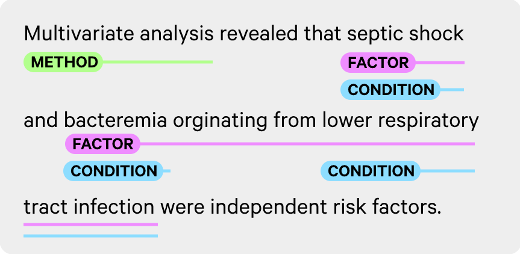

# A pipeline for Semantic Metagraph-based Information Extraction and Decomposition (SMIED)

SMIED primarily serves as middleware for associating SpaCy dependency parses and constituency parses with:
- AMR graphs in Penman format
- FRED graphs
SMIED does this by restructuring each of these parses into SemanticMetagraph objects, which are associated via shared token references.

Representing semantic grounding relations with metagraph structures is significantly more concise than (relatively) traditional hypergraph and regular-graph-based representations.
The set-like, nested structure of metavertices also retains significantly more interpretability than these other approaches as the number of tokens and inter-token relations increases. This is because subgraphs and subgraph-token relations can be abstracted away.

Take SpaCy's [SpanCategorizer module](https://spacy.io/api/spancategorizer) for example, which tags overlapping spans with variable granularity.
To represent the overlapping span-token relations for the sentence "Multivariate analysis revealed that septic shock and bacteremia originating from lower respiratory tract infection were independent risk factors." (see Figure 1), we'd need a minimum of:
- 21 vertices (18 words + 3 span classes)
- 18 pairwise edges (2 words x 1 class + 2x2 + 1x1 + 7x1 + 4x1)
and, unless we add a custom edge property for it, this loses any intra-span token positional information!



Figure 1: an example from [ExplosionAI's blog post on SpanCat](https://explosion.ai/blog/spancat)

With a semantic metagraph, though, we'd only need:
- 18 atomic metavertices (18 words)
- 6 directed metavertices (6 spans)
- 3 undirected metavertices (3 span classes)

A 30% reduction! ($\frac{(21+18) - (18+6+3)}{21+18}$).
Using different metavertex types even gives us intra-span token ordering for free!

Visually, the difference is even more apparent:
### ADD METAGRAPH VISUALIZATIONS HERE WHEN YOU FINISH [[Visualizations.py]]
---

## Quick Start
1. Install a SpaCy pipeline using one of the following commands:
    - `python -m spacy download en_core_web_sm`
    - `python -m spacy download en_core_web_md`
    - `python -m spacy download en_core_web_lg`
2. Run `pip install git+https://github.com/IsaacFigNewton/SMIED.git` to install SMIED from the repo's main branch.
3. Try running the full pipeline on a piece of text with the following snippet:
```python
    import spacy
    from smied import SemanticMetagraph
    
    nlp = spacy.load('en_core_web_sm')
    text = "The quick brown fox jumps over the lazy dog."
    doc = nlp(text)
    
    G = SemanticMetagraph(doc)
    
    G.plot()
```
---

## Testing
Note: If modifying parts of the package, you may want to install smied with `pip install -e git+https://github.com/IsaacFigNewton/SMIED.git` in lieu of step 2 above.

### Unittest Framework
Open and run `tests.py` in the SDE of your choice.

### Pytest Framework
1. SMIED should have installed the pytest package as one of its dependencies, but if it didn't, you can do so manually with `pip install pytest`
2. Run `python -m pytest` to run all the unit tests.
---