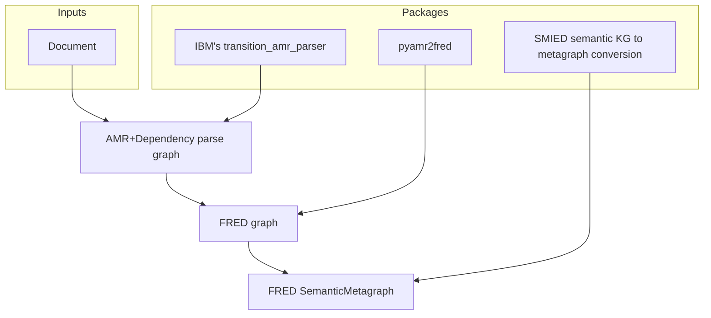

```mermaid
flowchart TD
    %% Inputs (data sources)
    subgraph Inputs
        direction TB
        Document[Document]
    end

    %% Packages/tools that feed the processors
    subgraph Packages
        direction TB
        transition_amr_parser["IBM's transition_amr_parser"]
        pyamr2fred[pyamr2fred]
        SMIED["SMIED semantic KG to metagraph conversion"]
    end

    %% Processing / output nodes
    AMRDep[AMR+Dependency parse graph]
    FRED[FRED graph]
    SemanticMetagraph[FRED SemanticMetagraph]

    %% Connections
    Document --> AMRDep
    transition_amr_parser --> AMRDep
    pyamr2fred --> FRED
    AMRDep --> FRED
    SMIED --> SemanticMetagraph
    FRED --> SemanticMetagraph
```